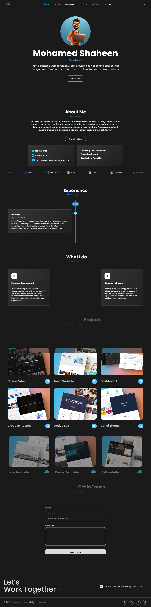

# My Portfolio

This is a modern, responsive, and interactive portfolio website built with React.js, showcasing my work, skills, and contact information. It includes dynamic animations, smooth transitions, and a user-friendly experience. The website is optimized for performance and accessibility, ensuring a seamless browsing experience across all devices.

## Features

- **React Router**: Seamless navigation between pages.
- **Tailwind CSS**: Custom styling and responsive layout.
- **React Slick & Swiper**: Smooth sliders for project showcases.
- **React Toastify**: User notifications for better interaction.
- **Motion**: Animations for an engaging user experience.
- **Formspree**: Handles contact form submissions effortlessly.
- **Vite**: Fast build and development environment.
- **Optimized Assets**: Minified images, lazy loading, and optimized performance.

## Technologies Used

- **React.js**: JavaScript library for building UI.
- **Vite**: Next-gen frontend tooling for fast builds.
- **Tailwind CSS**: Utility-first CSS framework.
- **React Router**: Routing library for navigation.
- **React Slick**: Carousel component.
- **Swiper**: Carousel component.
- **React Toastify**: Notification component.
- **Motion**: Animation library.
- **Formspree**: Contact form integration.

## Screenshots

